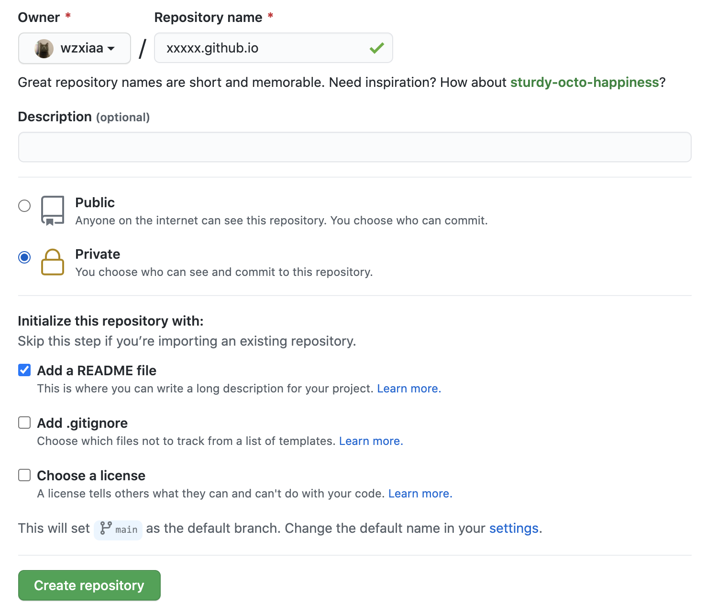

This is my very first blog post on how to build a blog site powered by Github.io, Hexo and NexT. It won't take even 10 minutes to set things up and running. It is fairly simple and easy to maintain. Let's get started!

<!-- more -->

## Installation

### Install Node.js & npm with Homebrew 

More info: [Node.js](https://nodejs.org/en/download/package-manager/)

```bash
$ brew install node
```

### Install [Hexo](https://hexo.io/docs/)

```bash
$ npm install -g hexo-cli
```
### Initialize Hexo Blog project 
```bash
$ hexo init hexo-site
$ cd hexo-site
$ npm install
```
### Install Theme - [NexT](https://theme-next.js.org/docs/getting-started/)
```bash
$ cd hexo-site
$ ls
_config.yml  node_modules  package-lock.json  package.json  scaffolds  source  themes

$ git clone https://github.com/next-theme/hexo-theme-next themes/next
```


## Github.io

### Create a repository on Github with name {username}.github.io:

### Install hexo git plugin
```bash
$ npm install hexo-deployer-git --save
```


## Configuration

### Deploy on Github
Modify the `deploy` in  `hexo-site/_config.yml` file:
```bash
# Deployment
## Docs: https://hexo.io/docs/one-command-deployment
deploy:
  type: git
  repo: https://github.com/{username}/{username}.github.io.git
  branch: main
```
### Set NexT as Theme
Again, modify the `theme` in the same `hexo-site/_config.yml` file
```bash
theme: next
```


## Quick Start

### Create a new post

```bash
$ hexo new "My New Post"
```

More info: [Writing](https://hexo.io/docs/writing.html)

### Run server

```bash
$ hexo server
```

Now you can access the local bog site at [http:localhost:4000](http://localhost:4000)

More info: [Server](https://hexo.io/docs/server.html)

### Generate static files

```bash
$ hexo generate
```

More info: [Generating](https://hexo.io/docs/generating.html)

### Deploy to remote sites

```bash
$ hexo deploy
```

More info: [Deployment](https://hexo.io/docs/one-command-deployment.html)

Now your project has been deployed to Github repository and you can access your blog site at [{username}.github.io]({username}.github.io)


## Additional Information

Now you are ready to start working on the blog. More Hexo configuration guide can be found at:

[https://hexo.io/docs/configuration.html](https://hexo.io/docs/configuration.html)

Documentation for NexT theme setting can be found at: 

[https://theme-next.js.org/docs/theme-settings/](https://theme-next.js.org/docs/theme-settings/)

