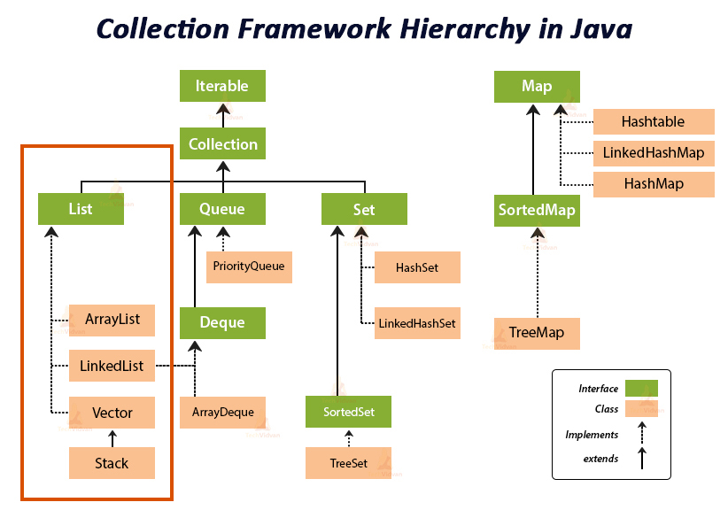

---

title: Java Collections.List 集合工具类一(List)
date: 2020-12-09 14:56:41
tags:
  - Java Basics
  - Collections
  - List
category:
  - Java Road Map
---

Java Collections Framework is one of the most essential Java API. The API provides implementations of standard data structure in Java-like linked list, set, stack, queue, hash table, priority queue and others. A `collection` represents a single unit of objects. The `collection framework` represents a unified architecture for storing and manipulating a group of objects



<!-- more -->

# Collections

## List Interface

The `List` interface provides a way to store the ordered collection. It is a child interface of [Collection](https://www.geeksforgeeks.org/collections-in-java-2/). It is an ordered collection of objects in which duplicate values can be stored. Since List preserves the insertion order, it allows positional access and insertion of elements.

### `ArrayList`

Resizable-array implementation of the `List` interface. Permits all elements, including `null`. `ArrayList` is `not synchronized`. ArrayList implements `RandomAccess`, `Cloneable`, `Serializable`. Its equivalent synchronized class in Java is `Vector`. 

Default capacity of ArrayList is 10. Once maximum capacity is reached, it increments as following:

```
New capacity = (current capacity * 3/2) + 1
```

Upon every increment cycle, ArrayList increases it size by around ***50%*** of original.

Dynamic expansion:

- Creates a bigger sized memory on heap memory.
- Copies the current memory elements to the new memory.
- New items added to the new memory.
- Delete the old memory

***

#### Get(int index) Method

> Simply returns the element at the specified position in this list.

```java
    public E get(int index) {
        rangeCheck(index);

        return elementData(index);
    }
```

***

#### Add(E e) Method

>
Inserts the specified element at the specified position in this list. Shifts the element currently at that position (if any) and any subsequent elements to the right (adds one to their indices).

```java
    public void add(int index, E element) {
        rangeCheckForAdd(index);

        ensureCapacityInternal(size + 1);  // Increments modCount!!
        System.arraycopy(elementData, index, elementData, index + 1,
                         size - index);
        elementData[index] = element;
        size++;
    }
```

***

#### Capacity Expansion

```java
    public void ensureCapacity(int minCapacity) {
        int minExpand = (elementData != DEFAULTCAPACITY_EMPTY_ELEMENTDATA)
            // any size if not default element table
            ? 0
            // larger than default for default empty table. It's already
            // supposed to be at default size.
            : DEFAULT_CAPACITY;

        if (minCapacity > minExpand) {
            ensureExplicitCapacity(minCapacity);
        }
    }

    private static int calculateCapacity(Object[] elementData, int minCapacity) {
        if (elementData == DEFAULTCAPACITY_EMPTY_ELEMENTDATA) {
            return Math.max(DEFAULT_CAPACITY, minCapacity);
        }
        return minCapacity;
    }

    private void ensureCapacityInternal(int minCapacity) {
        ensureExplicitCapacity(calculateCapacity(elementData, minCapacity));
    }

    private void ensureExplicitCapacity(int minCapacity) {
        modCount++;

        // overflow-conscious code
        if (minCapacity - elementData.length > 0)
            grow(minCapacity);
    }

    private void grow(int minCapacity) {
        // overflow-conscious code
        int oldCapacity = elementData.length;
        int newCapacity = oldCapacity + (oldCapacity >> 1);
        if (newCapacity - minCapacity < 0)
            newCapacity = minCapacity;
        if (newCapacity - MAX_ARRAY_SIZE > 0)
            newCapacity = hugeCapacity(minCapacity);
        // minCapacity is usually close to size, so this is a win:
        elementData = Arrays.copyOf(elementData, newCapacity);
    }
```

***

### `LinkedList`

Doubly-linked list implementation of the `List` and `Deque` interfaces. Implements all optional list operations, and permits all elements (including `null`). Operations that index into the list will traverse the list from the beginning or the end, whichever is closer to the specified index. `LinkedList` is `not synchronized`. LinkedList implements `Serializable`, `Cloneable`, `Deque<E>`, `Queue<E>`. 

Acts like a dynamic array:

- No need to specify the size upon initialization.
- Size increases dynamically (add, remove)
- Elements are not stored in continuous fashion.

```java
# Add Elements
boolean add(E e)	# appends the specific element to the end of the list
void add(int index, E element) # inserts the specified element at specified position
boolean addAll(Collection<? extends E>c) # appends all of the elements to the end
void addFirst(E e) # inserts the element at the beginning
void addLast(E e) # appends the element at the end
  
# Search Elements
Object get(int index) # returns the element at specified position
Object getFirst() # returns the first element
object getLast() # returns the last element

# Update Elements
E set(int index, E element) # replace the element at the specified position
  
# Remove Elements
E remove() # removes the element at the beginning
E remove(int index) # removes the element at the specified position
E removeFirst() # removes and returns the first element
E removeLast() # removes and returns the last element

# Retrieve Elements (does not remove)
E peek() # retrieves, but does not remove the first element (head)
E peekFirst() # retrieves, but does not remove the first element (returns null if empty)
E peekLast() # retrieves, but does not remove the last element (returns null if empty)  

# Retrieve Elements (and remove)
E poll() # retrieves, and removes the first element (head)
E pollFirst() # retrieves and removes the first element (returns null if empty)
E pollLast() # retrieves and removes the last element (returns null if empty)  
  
# Stack like operation
E pop() # pops an element from the stack represented by this list
E push(E e) # pushes an element onto the stack represented by this list
```


---

### `Vector`

The **Vector** class implements a growable array of objects. Vectors basically fall in legacy classes but now it is fully compatible with collections. It can grow or shrink as required. `Vector` is similar to `ArrayList` but it is `synchronized`. Rarely used in non-thread environment due to poor performance in add, search, delete and update operations.

If the vector increment is not specified then it's capacity will be doubled in every increment cycle.

---

### `Stack`

The `Stack` class is based on the basic principle of `last-in-first-out`. In addition to the basic push and pop operations, the class provides three more functions of empty, search, and peek.

A more complete and consistent set of LIFO stack operations is provided by the [`Deque`](https://docs.oracle.com/javase/7/docs/api/java/util/Deque.html) interface and its implementations,

```java
Deque<Integer> stack = new ArrayDeque<Integer>();
```

Generally, `Deque` is better as:

- in terms of object orient design as it is an interface whereas `Stack` is a class. Using `Deque`removes the dependency on concret `Stack` class. 
- `Stack` extends `Vector` and allows elements to be accessed by index. It is inconsistent with what general LIFO data structures should provide for.
- Performance. `Stack` is synchronized which could introduce performance overheads.


---

### Performance Comparison

|               | ArrayList | LinkedList |
| :-----------: | :-------: | :--------: |
|  get(index)   |   O(1)    |    O(n)    |
|    add(E)     |   O(1)    |    O(1)    |
| add(index, E) |   O(n)    |    O(n)    |
| remove(index) |   O(n)    |    O(n)    |

Time complexity:

`ArrayList` is ***faster*** for ***accessing*** specific elements as it allows `RandomAccess`. Especially slow for deleting at middle.

`LinkedList` is ***faster*** for ***adding*** and ***deleting*** elements. It is `slow` to access an element.

