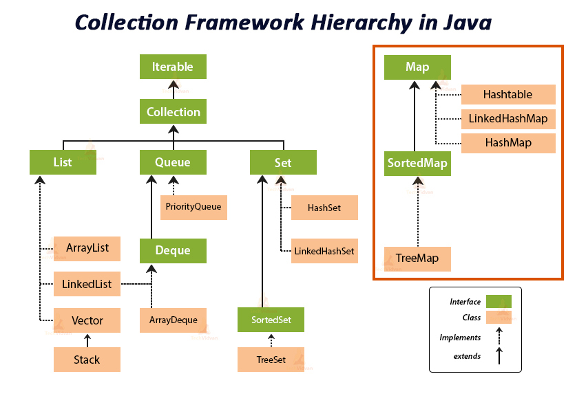
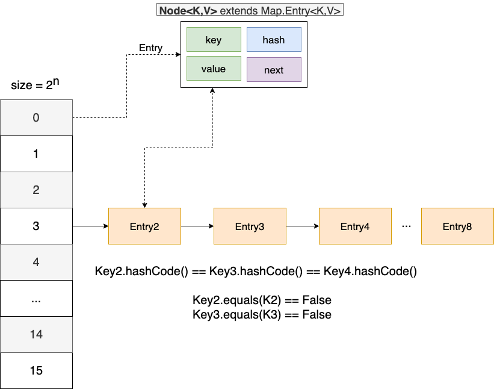
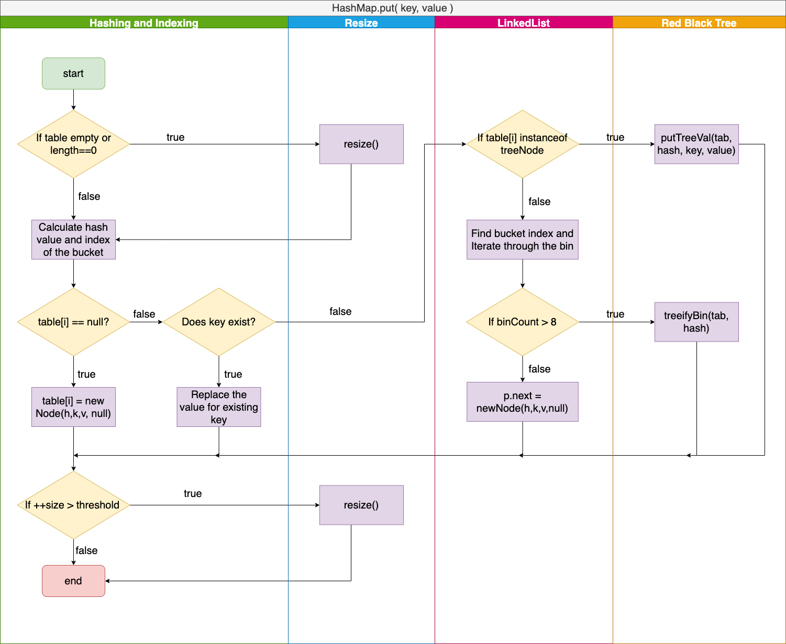
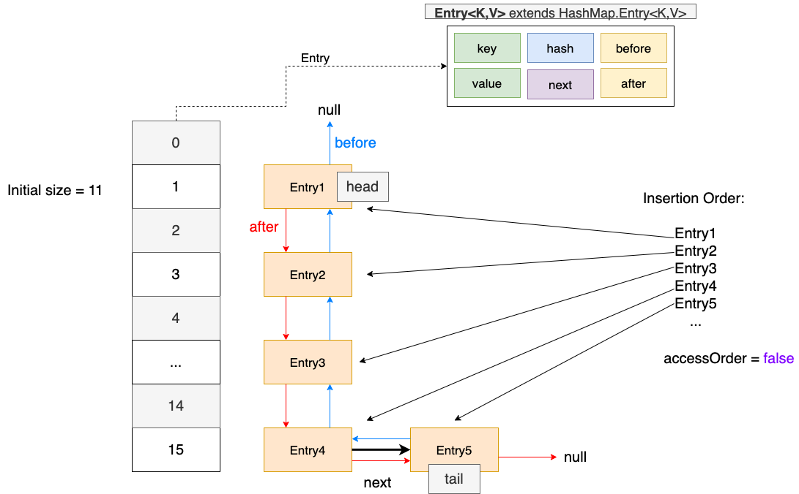
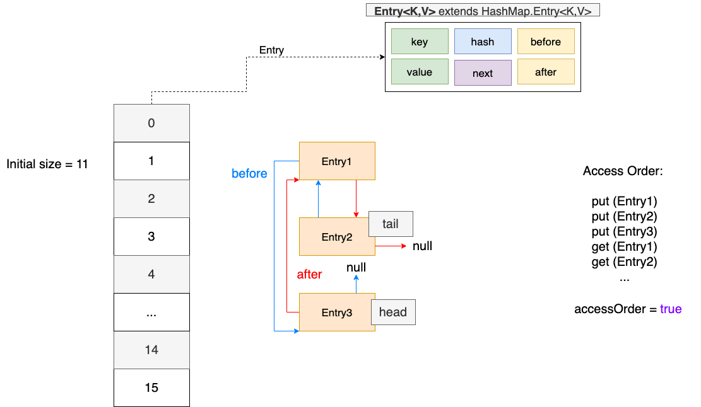
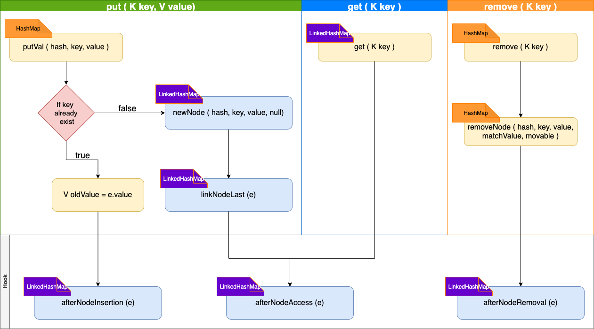

## Map Interface Overview



Java `Map` interface is one of the most important and most widely used API. A [`Map`](https://docs.oracle.com/javase/8/docs/api/java/util/Map.html) is an object that maps keys to values. A map cannot contain duplicate keys: Each key can map to at most one value. 

<!-- more -->

***

### `HashMap`

Java `HashMap` class implements the `Map` interface which allows to store key and value pair, where keys should be ***unique***. 

- Java HashMap allows null key and null values
- HashMap is not an ordered collection. `HashMap.keySet()` is not in order of their addition.
- HashMap is ***not synchronized***.
- HashMap stores entries into multiple singly linked lists, called buckets or bins. Default number of bins is ***16*** and it's always in power of 2.
- HashMap is ***not thread safe***, `ConcurrentHashMap` should be used or get synchronized map using `Collections.synchronizedMap()` method.

***

#### Architecture

The architecture of `HashMap` is as follow:

- Internally, an array of `Node<K,V>` class is used to store the data, also known as a **bucket**.
- `Node<K,V>` has four attributes:
  - `int hash` , `K key`,  `V value`, `Node<K,V> next`
- Bucket has a `LinkedList` data structure to store multiple nodes.
- Array is fast in terms of search with ***O(1)*** time, inserting and deleting is slower and has ***O(n)*** time. On the onter hand, LinkedList is fast for inserting and deleting while slow for searching. HashMap utilizes the different characteristics of the two data structures to enhance its performance.




***

#### Initialization

Upon intitialization, there are two attributes that are important:

- InitialCapacity:  It specified the initial capacity of the array (number of buckets). By default, it is set to **16**.
- loadFactor: It is a measure that decides when to increase the HashMap capacity to maintain the `get()` and `put()` operation complexity of ***O(1)***. Be default. it is set to be **0.75f**. When number of buckets filled equals to initial Capacity*loadFactor, the size will be doubled.

Constructors:

```java
# initial capacity 16, load factor 0.75
Map<String, String> map1 = new HashMap<>();

# specify initial capacity, load factor 0.75
Map<String, String> map2 = new HashMap<>(2^5);

# specify initial capacity and load factor
Map<String, String> map3 = new HashMap<>(32,0.80f);

# creates a Map having same mappings as the specified map with load 
# factor 0.75
Map<String,String> map4 = new HashMap<>(map1);
```

***

#### Hashing Mechanism

Hashing is designed to solve the problem of needing to efficiently find or store an item in a collection. 

- **HashCode()** method : 
  - It returns the memory reference of the object in integer form. Hash code for `null` object is **0**.
- **equals()** method:
  - It checks the equality of two objects. It can be overriden.
  - If **equals()** method is overriden, it is mandatory to override the **hashCode()** method as well.

Generally, the hashCode() and equals() method should follow the following rules:

1. If `obj1.equals(obj2)`, then `obj1.hashCode()==obj2.hashCode()` should always be true.
2. If `obj1.hashCode()==obj2.hashCode()` is true, `obj1.equals(obj2)` does not have to be true.

***

In `HashMap`, the hashing mechanism works in two steps:

- When an entry is added into the HashMap, it computes the hashcode on the key of the entry using `hashCode()`. ==> ***first hash***
- The bitwise XOR operator is then used to spread the higher bits to  lowers. ==> ***second hash***

The implementations:

```java
static final int hash(Object key) {
    int h;
    return (key == null) ? 0 : (h = key.hashCode()) ^ (h >>> 16);
}
```

Based on the hash code computed, the index of the bucket for the enrty to be put into is then calculated:

```java
index = (n-1) & hash // n is the size of the bucket
```

A **Hash Collision** is a situation where **two or more key objects produce the same final hash value** and hence point to the same bucket location or array index. This scenario can occur because according to the *equals* and *hashCode* contract, **two unequal objects in Java can have the same hash code**. It can also happen because of the finite size of the underlying array, that is, before resizing. The smaller this array, the higher the chances of collision.

***

#### HashMap put( K, V ) Method

The flow chart below demonstrates the execution logic of `put` method:



Source code for JDK1.8 HashMap:

```java
    public V put(K key, V value) {
        return putVal(hash(key), key, value, false, true);
    }
    
    final V putVal(int hash, K key, V value, boolean onlyIfAbsent,
                   boolean evict) {
        Node<K,V>[] tab; Node<K,V> p; int n, i;
        // If table is empty or length == 0
        if ((tab = table) == null || (n = tab.length) == 0)
            n = (tab = resize()).length;
        // Calculate hash value and put in the entry
        if ((p = tab[i = (n - 1) & hash]) == null)
            tab[i] = newNode(hash, key, value, null);
        else {
            Node<K,V> e; K k;
            // If key already exists, replace the value
            if (p.hash == hash &&
                ((k = p.key) == key || (key != null && key.equals(k))))
                e = p;
            // If the bin is a red black tree
            else if (p instanceof TreeNode)
                e = ((TreeNode<K,V>)p).putTreeVal(this, tab, hash, key, value);
            else {
              	// If the bin is a linkedlist
                for (int binCount = 0; ; ++binCount) {
                    if ((e = p.next) == null) {
                        p.next = newNode(hash, key, value, null);
                      	// If linkedlist length greater than 8, treeify
                        if (binCount >= TREEIFY_THRESHOLD - 1) // -1 for 1st
                            treeifyBin(tab, hash);
                        break;
                    }
                    // Key already exists, replace the value
                    if (e.hash == hash &&
                        ((k = e.key) == key || (key != null && key.equals(k))))
                        break;
                    p = e;
                }
            }
            if (e != null) { // existing mapping for key
                V oldValue = e.value;
                if (!onlyIfAbsent || oldValue == null)
                    e.value = value;
                afterNodeAccess(e);
                return oldValue;
            }
        }
        ++modCount;
        // resize if the size greater than threshold capacity
        if (++size > threshold)
            resize();
        afterNodeInsertion(evict);
        return null;
    }    
```

***

#### HashMap get(Object key) Method

The get method is straightforward, based on the hash code computed for the input key, it finds the bucket corresponds to the hash value and iterate through all the map entries stored there. ***equals()*** is used to compare the key and if no such key available, `null` is returned.

Source code for JDK1.8 HashMap:

```java
    public V get(Object key) {
        Node<K,V> e;
        return (e = getNode(hash(key), key)) == null ? null : e.value;
    }
    
    final Node<K,V> getNode(int hash, Object key) {
        Node<K,V>[] tab; Node<K,V> first, e; int n; K k;
        if ((tab = table) != null && (n = tab.length) > 0 &&
            (first = tab[(n - 1) & hash]) != null) {
            if (first.hash == hash && // always check first node
                ((k = first.key) == key || (key != null && key.equals(k))))
                return first;
            if ((e = first.next) != null) {
                if (first instanceof TreeNode)
                    return ((TreeNode<K,V>)first).getTreeNode(hash, key);
                do {
                    if (e.hash == hash &&
                        ((k = e.key) == key || (key != null && key.equals(k))))
                        return e;
                } while ((e = e.next) != null);
            }
        }
        return null;
    }    
```

#### Examples

```java
    public static void main(String[] args) {
        // create a HashMap instance
        HashMap<String, String> hm = new HashMap<String, String>();
        // put entries into the HashMap
        hm.put("Canada", "Montreal");
        hm.put("America", "New York");
        hm.put("Korea", "Soul");
        hm.put("China", "Shanghai");
        hm.put("China", "Beijing"); // duplicated key
        System.out.println(hm);
        System.out.println(hm.get("China")); // get the value for a key
        // iterate through the HashMap key set
        for(String s: hm.keySet()) {
            System.out.println("key: " + s + "; value: " + hm.get(s));
        }
        // iterate through the HashMap values
        for (String value: hm.values()) {
            System.out.println("value: " + value);
        }
    }
```

Output:

```
{China=Beijing, Korea=Soul, Canada=Montreal, America=New York}
Beijing
key: China; value: Beijing
key: Korea; value: Soul
key: Canada; value: Montreal
key: America; value: New York
value: Beijing
value: Soul
value: Montreal
value: New York
```

***

### `HashTable`

The `HashTable` class implements a hash table, which maps keys to values. Any non-null object can be used as a key or as a value. To successfully store and retrieve objects from a `HashTable`, the objects used as keys must implement the `hashCode()` method and `equals()` method. Generally, HashTable is vert similar to HashMap except for the following differenes:

- HashTable is ***synchronized***
- The initial capacity of `HashTable` class is ***11***, whereas loadFactor is ***0.75***
- HashTable implements `Serializable`, `Cloneable`, `Map<K,V>` interface as well as `Dictionary<K,V>`

#### Example

```java
    public static void main(String[] args) {
        Hashtable<String, String> ht = new Hashtable<String, String>();
        ht.put("Canada", "Montreal");
        ht.put("America", "New York");
        ht.put("Korea", "Soul");
        ht.put("China", "Shanghai");
        ht.put("China", "Beijing"); // duplicated key
        System.out.println(ht);
        System.out.println(ht.get("China")); // get the value for a key
        // iterate through the HashMap key set
        for(String s: ht.keySet()) {
            System.out.println("key: " + s + "; value: " + ht.get(s));
        }
        // iterate through the HashMap values
        for (String value: ht.values()) {
            System.out.println("value: " + value);
        }
    }
```

Output:

```
{China=Beijing, Korea=Soul, Canada=Montreal, America=New York}
Beijing
key: China; value: Beijing
key: Korea; value: Soul
key: Canada; value: Montreal
key: America; value: New York
value: Beijing
value: Soul
value: Montreal
value: New York
```

***

#### HashTable Usage

Java `HashTable` has been considered to be ***deprecated***, and in fact, most of the synchronized collections have been deprecated. Synchronization has a cost and using synchronized collection in places where there is no need of it leads to useless utilization of resources. Under multi-threaded environment, Java `ConcurrentHashMap` is a good alternative which provides better performance than `HashTable`. 

***

### `LinkedHashMap` 

The `LinkedHashMap` is just like [HashMap](http://www.geeksforgeeks.org/java-util-hashmap-in-java/) with an additional feature of maintaining an order of elements inserted into it. HashMap provided the advantage of quick insertion, search, and deletion but it never maintained the track and order of insertion which the LinkedHashMap provides where the elements can be **accessed in their insertion order**.

Important features of LinkedHahsMap:

-  `LinkedList` implements `Map` interface and extends the `HashMap` class
- It allows only unique elements
- It allows one `null` key and multiple `null` values
- It is ***not synchronized***
- It is provides additional functionalities of maintaining insertion order of elements

***

#### Map Entries

To maintain the order of elements, the linked hashmap modifies the *Map.Entry* class of *HashMap* by adding pointers to the next and previous entries:

```Java
    static class Entry<K,V> extends HashMap.Node<K,V> {
        Entry<K,V> before, after;
        Entry(int hash, K key, V value, Node<K,V> next) {
            super(hash, key, value, next);
        }
    }
```

Two pointers: ***head*** and ***tail*** are added which enables itself to hook to the linked list. 

---

#### Architecture

1. If `accessOrder == false`, it will result in insertion order. 

The architecture is similar to that of HashMap:



The above diagram shows the structure of the LinkedHashMap when `accessOrder = false` which is the default setting. The insertion order is maintained through the doubly linkedlist. When a `put(K,V)` is called, the entry is put to the tail of the linkedlist. 

***

2. If `accessOrder == true`, the it will result in access order. One of the important application of access order LinkedHashMap is building ***LRU*** cache. 



The above diagram shows the structure of the LinkedHashMap when `accessOrder = true`. The doubly linkedlists of the nodes preserve the order by which they are accessed. The least recently accessed element will become the head, while the most recently accessed element becomes the tail. 

>A structural modification is any operation that adds or deletes one or more mappings or, in the case of access-ordered linked hash maps, affects iteration order.  In insertion-ordered linked hash maps, merely changing the value associated with a key that is already contained in the map is not a structural modification.  In access-ordered linked hash maps, merely querying the map with <tt>get</tt> is a structural modification.

***

`LinkedHashMap` class overridestes multiple functions that helps it to maintain the doubly linked list as well as preserve the insertion or access order. Below is an overview of the execution flow:



The implementation of the specific functionalities will be discussed in the following subsections.

***

#### LinkedHashMap.put( K, V ) Method

LinkedHashMap reuses the `put` implementation from HashMap class. Everytime a new node is created and put into the bucket, `newNode(hash, key, value, next)` is called. However, the original method implementation could not perform operations related to the doubly linked list. Hence, `LinkedHashMap` class overridestes the `newNode` method: 

```java
    // Overriden by LinkedHashmap
		Node<K,V> newNode(int hash, K key, V value, Node<K,V> e) {
        LinkedHashMap.Entry<K,V> p =
            new LinkedHashMap.Entry<K,V>(hash, key, value, e);
        linkNodeLast(p);
        return p;
    }
```

The `linkNodeLast` method implementation:

```java
// Implemented by LinkedHashmap
// link at the end of list
    private void linkNodeLast(LinkedHashMap.Entry<K,V> p) {
        LinkedHashMap.Entry<K,V> last = tail;
        tail = p;
        if (last == null)
            head = p;
        else {
            p.before = last;
            last.after = p;
        }
    }
```

***

#### LinkedHashMap.get( K, V ) Method

The `LinkedHashMap` overrides the `afterNodeAccess` method. By default, the linkedhashmap maintain the order of the elements by the order of insertion. If `accessOrder` is specified to be `true` during initialization, the order will be preserved by the access order. This can be easily done by moving the node to the tail of the doubly linked list when `get` or `getOrDefault` or `replace` methods are invoked. `afterNodeAccess` method overriden by LinkedHashMap provides such functionality:

```java
    // Overriden by LinkedHashMap
    public V get(Object key) {
        Node<K,V> e;
        if ((e = getNode(hash(key), key)) == null)
            return null;
        if (accessOrder)
            afterNodeAccess(e);
        return e.value;
    }

		// Overriden by LinkedHashMap
    void afterNodeAccess(Node<K,V> e) { // move node to last
        LinkedHashMap.Entry<K,V> last;
        if (accessOrder && (last = tail) != e) {
            LinkedHashMap.Entry<K,V> p =
                (LinkedHashMap.Entry<K,V>)e, b = p.before, a = p.after;
            p.after = null;
            if (b == null)
                head = a;
            else
                b.after = a;
            if (a != null)
                a.before = b;
            else
                last = b;
            if (last == null)
                head = p;
            else {
                p.before = last;
                last.after = p;
            }
            tail = p;
            ++modCount;
        }
    }
```

***

#### LinkedHashMap.remove (K) Method

The LinkedHashMap class reuses the HashMap's implementation for the removing the entries. However, in order to remove the entry from the doubly linked list, additional efforts has to be made as the parent class implementation could not do that. Hence, the hook method `afterRemoval` is overriden for this purpose. The `remove` and `removeNode` implementation:

```java
    // Implemented by HashMap
    public V remove(Object key) {
        Node<K,V> e;
        return (e = removeNode(hash(key), key, null, false, true)) == null ?
            null : e.value;
    }

    // Implemented by HashMap
    final Node<K,V> removeNode(int hash, Object key, Object value,boolean matchValue, boolean movable) {
            Node<K,V>[] tab; Node<K,V> p; int n, index;
            if ((tab = table) != null && (n = tab.length) > 0 &&
                (p = tab[index = (n - 1) & hash]) != null) {
                Node<K,V> node = null, e; K k; V v;
                if (p.hash == hash &&
                    ((k = p.key) == key || (key != null && key.equals(k))))
                    node = p;
                else if ((e = p.next) != null) {
                    if (p instanceof TreeNode)
                        node = ((TreeNode<K,V>)p).getTreeNode(hash, key);
                    else {
                        // iterate through the list
                        do {
                            if (e.hash == hash &&
                                ((k = e.key) == key ||
                                 (key != null && key.equals(k)))) {
                                node = e;
                                break;
                            }
                            p = e;
                        } while ((e = e.next) != null);
                    }
                }
                if (node != null && (!matchValue || (v = node.value) == value ||
                                     (value != null && value.equals(v)))) {
                    if (node instanceof TreeNode)
                        ((TreeNode<K,V>)node).removeTreeNode(this, tab, movable);
                    // remove the entry
                    else if (node == p)
                        tab[index] = node.next;
                    else
                        p.next = node.next;
                    ++modCount;
                    --size;
                    // hook method to be called
                    afterNodeRemoval(node);
                    return node;
            }
        }
        return null;
    }
```

The `afterNodeRemoval` implementation:

```java
    // Overriden by LinkedHashMap
    void afterNodeRemoval(Node<K,V> e) { // unlink
        LinkedHashMap.Entry<K,V> p =
            (LinkedHashMap.Entry<K,V>)e, b = p.before, a = p.after;
        p.before = p.after = null;
        if (b == null)
            head = a;
        else
            b.after = a;
        if (a == null)
            tail = b;
        else
            a.before = b;
    }
```

***

#### LRU Cache Implementation Using LinkedHashMap

Before looking at the ***Least Recently Used cache***  problem, the LinkedHashMap overrides the `afterNodeInsertion` method which possibly removes eldest node from the list:

```java
    // Overriden by LinkedHashMap
		void afterNodeInsertion(boolean evict) {
        LinkedHashMap.Entry<K,V> first;
        if (evict && (first = head) != null && removeEldestEntry(first)) {
            K key = first.key;
            removeNode(hash(key), key, null, false, true);
        }
    }
		
		// do nothing, always return false
    protected boolean removeEldestEntry(Map.Entry<K,V> eldest) {
        return false;
    }
```

After the `put` method is called, it invokes `afterNodeInsertion` method. By default, `afterNodeInsertion` does nothing as `removeEldestEntry` always return `false`. 

> This method typically does not modify the map in any way, instead allowing the map to modify itself as directed by its return value. It is permitted for this method to modify the map directly, but if it does so, it must return false. 

Hence, the `removeEldestEntry (Map.Entry)` method may be overriden to impose a policy for removing stale mapping automatically when new mappings are added to the map. This is the key to implement a LRU cache using LinkedHashMap.

The problem description of the ***Least Recently Used cache*** problem can be found on [leetcode](https://leetcode.com/problems/lru-cache/solution/). 

The implementation is as following:

```java
class LRUCache extends LinkedHashMap<Integer, Integer> {
    private int capacity;

    public LRUCache(int capacity) {
        super(capacity, 0.75f, true);
        this.capacity = capacity;
    }

    public int get(int key) {
        return super.getOrDefault(key, -1);
    }

    public void put(int key, int value) {
        super.put(key, value);
    }

    @Override
    protected boolean removeEldestEntry(Map.Entry<Integer, Integer> eldest) {
        return size() > capacity;
    }

    public static void main(String[] args) {
        LRUCache cache = new LRUCache(2);
        cache.put(1,1);
        cache.put(2,2);
        cache.put(3,3);
        cache.put(4,4);
        for (Integer value: cache.values()) {
            System.out.println("value: " + value);
        }
    }
}
```

Ouput:

```
value: 3
value: 4
```

In the above implementation, when `size() > capacity`, the `removeEldest` method will return true and as a result, the eldest node (head) will be removed. 

**Efficiency**

- Time complexity: O(1) for both `put` and `get` 

- Space complexity: O(capacity)

