## Queue Interface Overview

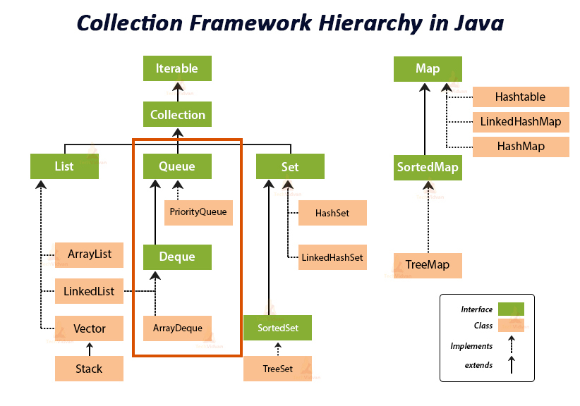

`Queue` is a collection designed for holding elements prior to processing. Besides basic [`Collection`](https://docs.oracle.com/javase/7/docs/api/java/util/Collection.html) operations, queues provide additional insertion, extraction, and inspection operations. Each of these methods exists in two forms: 

<!-- more -->

- one throws an exception if the operation fails
- the other returns a special value (either `null` or `false`, depending on the operation). 

The latter form of the insert operation is designed specifically for use with capacity-restricted `Queue` implementations; in most implementations, insert operations cannot fail.

|         | throws Exception | Returns special value |
| :-----: | :--------------: | :-------------------: |
| insert  |      add(e)      |       offer(e)        |
| remove  |     remove()     |        poll()         |
| examine |    element()     |        peek()         |

---

### `PriorityQueue`

#### Basic Concept

A priority queue is an Abstract Data Type that operates similar to a normal queue except that ***each element has a certain priority***. The priority of the element in the priority queue determine the order in which elements are removed from the PQ.

The most common implementation of a PQ is using `binary heap` (二叉小顶堆).

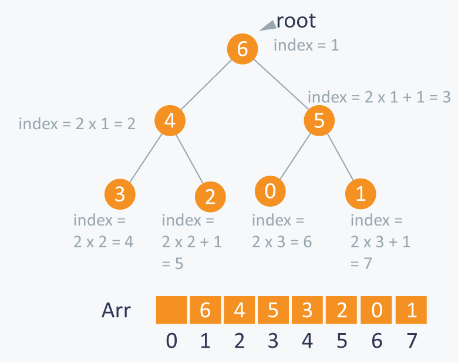

Indexing:

- Parent node index : i
- Left child node index : 2i
- Right child node index : 2i + 1
- Parent node = ( node_index - 1 )  / 2 

---

**Strength**:

- Quickly access the highest-priority item. Peek at the top item in ***O(1)*** while keeping other operations relatively cheap ***O(log(n))***.

**Weakness**:

- Slow enqueues and dequeues. Both operations take ***O(log(n))*** time with priority queues. With normal FIFO queues, the operations are ***O(1)*** time.

---

#### Java API

A `PriorityQueue` is used when the objects are supposed to be processed based on the priority. It is known that a [Queue](https://www.geeksforgeeks.org/queue-interface-java/) follows the `First-In-First-Out` algorithm. The PriorityQueue is based on the priority heap. The elements of the priority queue are ordered according to the natural ordering, or by a Comparator provided at queue construction time, depending on which constructor is used. It implements `Serializable`, `Iterable<E>`, `Collection<E>`,  ` Queue` interfaces.

Characteristics:

- Does not permit `null`
- Can't create PriorityQueue of objects that are non-comparable
- PriorityQueue are unbounded queues
- Not thread-safe, use `PriorityBlockingQueue` class for multi-threading
- ***O(log(n))*** for `add` and `poll`

---

##### Insert Element and ShiftUp

`add(e)` and `offer(e)` are equivalent except for the exception handling. add(e) throws exception while offer(e) returns null.

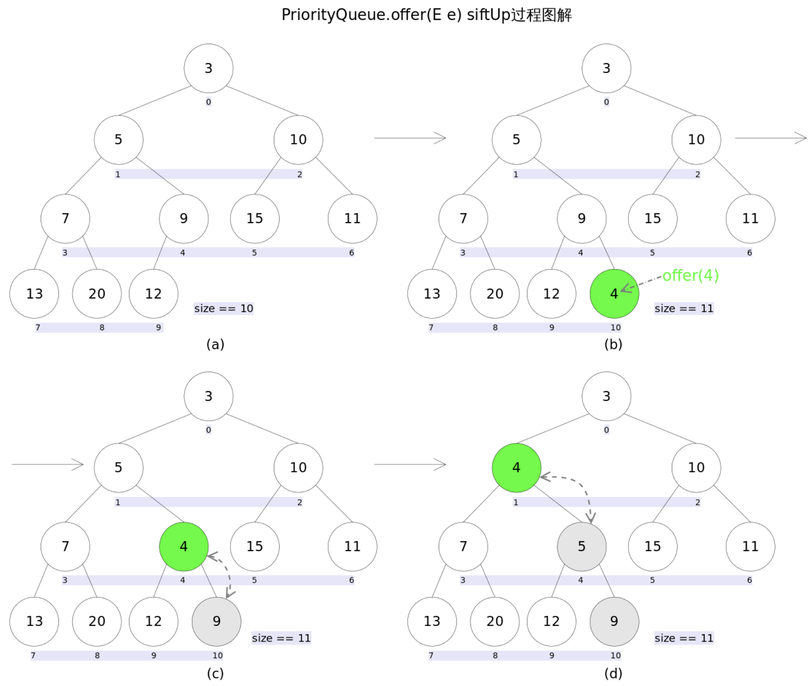

`Offer(e)` method implementation:

```java
    public boolean offer(E e) {
        if (e == null)
            throw new NullPointerException();
        modCount++;
        int i = size;
        if (i >= queue.length)
            grow(i + 1);
        size = i + 1;
        if (i == 0)
            queue[0] = e;
        else
            siftUp(i, e);
        return true;
    }
```

`siftUp(i, e)` method implementation:

```java
    private void siftUp(int k, E x) {
        if (comparator != null)
            siftUpUsingComparator(k, x);
        else
            siftUpComparable(k, x);
    }

    @SuppressWarnings("unchecked")
    private void siftUpComparable(int k, E x) {
        Comparable<? super E> key = (Comparable<? super E>) x;
        while (k > 0) {
            int parent = (k - 1) >>> 1; // parent node = (node-1)/2
            Object e = queue[parent];
            if (key.compareTo((E) e) >= 0)
                break;
            queue[k] = e;
            k = parent;
        }
        queue[k] = key;
    }
```

---

##### Peek/Element

`peek()` and `element()` are equivalent except for the exception handling. `peek()` returns `null` while `element()` throws exception.

peek() implementation:

```java
    public E peek() {
        return (size == 0) ? null : (E) queue[0];
    }
```


---

##### Remove head element

`poll()` and `remove()` are equivalent except for the exception handling. `remove()` returns `null` while `poll()` throws exception.

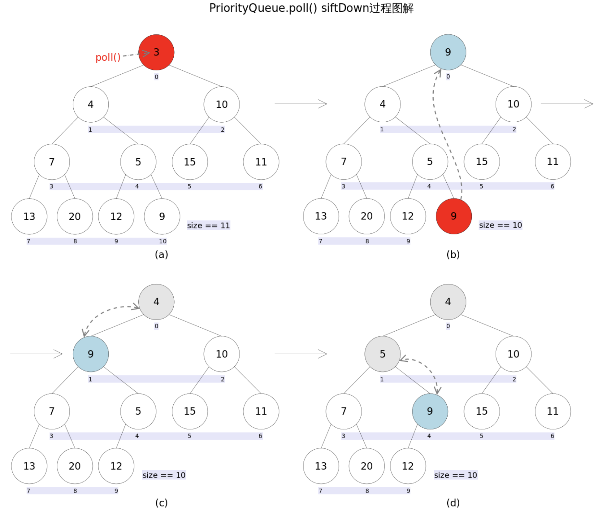

`poll()` method implementation:

```java
    public E poll() {
        if (size == 0)
            return null;
        int s = --size;
        modCount++;
        E result = (E) queue[0];
        E x = (E) queue[s];
        queue[s] = null;
        if (s != 0)
            siftDown(0, x);
        return result;
    }
```

`shiftDown(i, e)` method implementation:

```java
    private void siftDown(int k, E x) {
        if (comparator != null)
            siftDownUsingComparator(k, x);
        else
            siftDownComparable(k, x);
    }

    @SuppressWarnings("unchecked")
    private void siftDownComparable(int k, E x) {
        Comparable<? super E> key = (Comparable<? super E>)x;
        int half = size >>> 1;        // loop while a non-leaf
        while (k < half) {
            int child = (k << 1) + 1; // assume left child is least
            Object c = queue[child];
            int right = child + 1;
            if (right < size &&
                ((Comparable<? super E>) c).compareTo((E) queue[right]) > 0)
                c = queue[child = right];
            if (key.compareTo((E) c) <= 0)
                break;
            queue[k] = c;
            k = child;
        }
        queue[k] = key;
    }
```

---

##### Remove specific element

There are two scenarios:

- The element to be removed is the last element:
  - Delete immediately without modifying the queue structure

- The element is at somewhere else:
  - Apply shiftDown from the element to be removed with the last element in the queue.


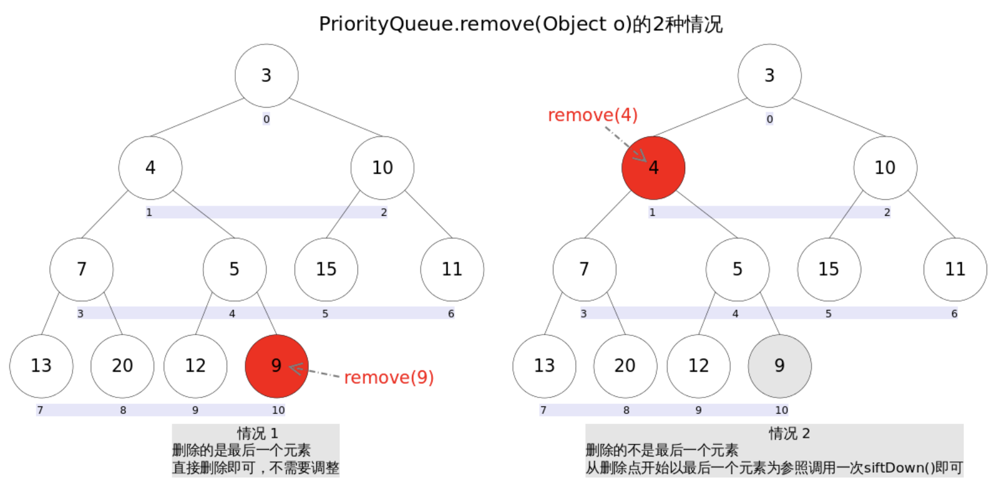


`remove(o)` implementation:

```java
    public boolean remove(Object o) {
        int i = indexOf(o);
        if (i == -1)
            return false;
        else {
            removeAt(i);
            return true;
        }
    }
    
    private E removeAt(int i) {
        // assert i >= 0 && i < size;
        modCount++;
        int s = --size;
        if (s == i) // removed last element
            queue[i] = null;
        else {
            E moved = (E) queue[s];
            queue[s] = null;
            siftDown(i, moved);
            if (queue[i] == moved) {
                siftUp(i, moved);
                if (queue[i] != moved)
                    return moved;
            }
        }
        return null;
    }
```

---


## Deque Interface

`Deque` stands for `Double Ended Queue`, which means this is a queue that can be accessed by both ends, and therefore can be used with both `FIFO` and `LIFO` styles. By default, it organizes its element `LIFO` style, meaning that getting the first in the `Deque` would return the last that had been added.

The `Deque` interface has the following implementations:

- LinkedList
- ArrayDeque

This interface defines methods to access the elements at both ends of the deque. Methods are provided to insert, remove, and examine the element. Each of these methods exists in two forms: one throws an exception if the operation fails, the other returns a special value (either `null` or `false`, depending on the operation). The latter form of the insert operation is designed specifically for use with capacity-restricted `Deque` implementations; in most implementations, insert operations cannot fail.

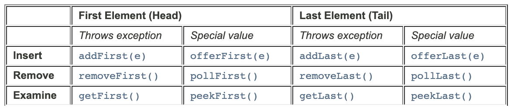

This interface extends the [`Queue`](https://docs.oracle.com/javase/7/docs/api/java/util/Queue.html) interface. When a deque is used as a queue, FIFO (First-In-First-Out) behavior results. Elements are added at the end of the deque and removed from the beginning. The methods inherited from the `Queue` interface are precisely equivalent to `Deque` methods as indicated in the following table:

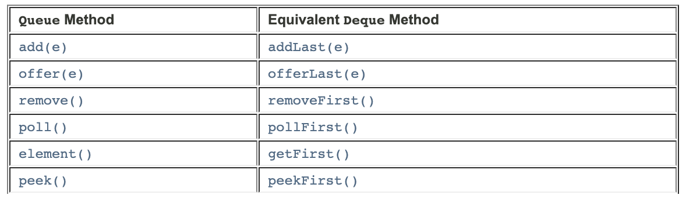

Deques can also be used as LIFO (Last-In-First-Out) stacks. This interface should be used in preference to the legacy [`Stack`](https://docs.oracle.com/javase/7/docs/api/java/util/Stack.html) class. When a deque is used as a stack, elements are pushed and popped from the beginning of the deque. Stack methods are precisely equivalent to `Deque` methods as indicated in the table below:

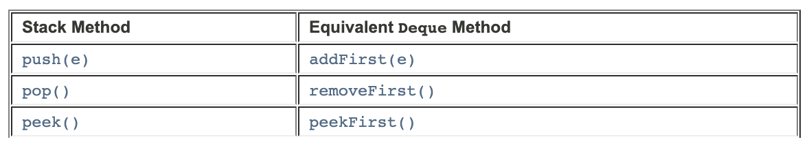


---


### `ArrayDeque`

Resizable-array implementation of the [`Deque`](https://docs.oracle.com/javase/8/docs/api/java/util/Deque.html) interface. Array deques have no capacity restrictions; they grow as necessary to support usage. They are not thread-safe. Null elements are prohibited.  Most `ArrayDeque` operations run in `amortized` constant time.

-  faster than [`Stack`](https://docs.oracle.com/javase/8/docs/api/java/util/Stack.html) when used as a stack, and
-  faster than [`LinkedList`](https://docs.oracle.com/javase/8/docs/api/java/util/LinkedList.html) when used as a queue.


Under the hood, `ArrayDeque` is backed by an array which doubles its size when it gets filled with an initial capacity of 16. Internally, It uses a `head` and `tail` as pointer to the index of the first and last elements in the array.

- **head**: the index of the element at the head of queue (which is the element to be removed by `remove()` and `pop()` method)
- **tail**: the index at which the next element would be added to the tail of the queue (via `addLast(E)`, `add(E)`, `push(E)`)

---

#### Use `ArrayDeque` as `Stack`

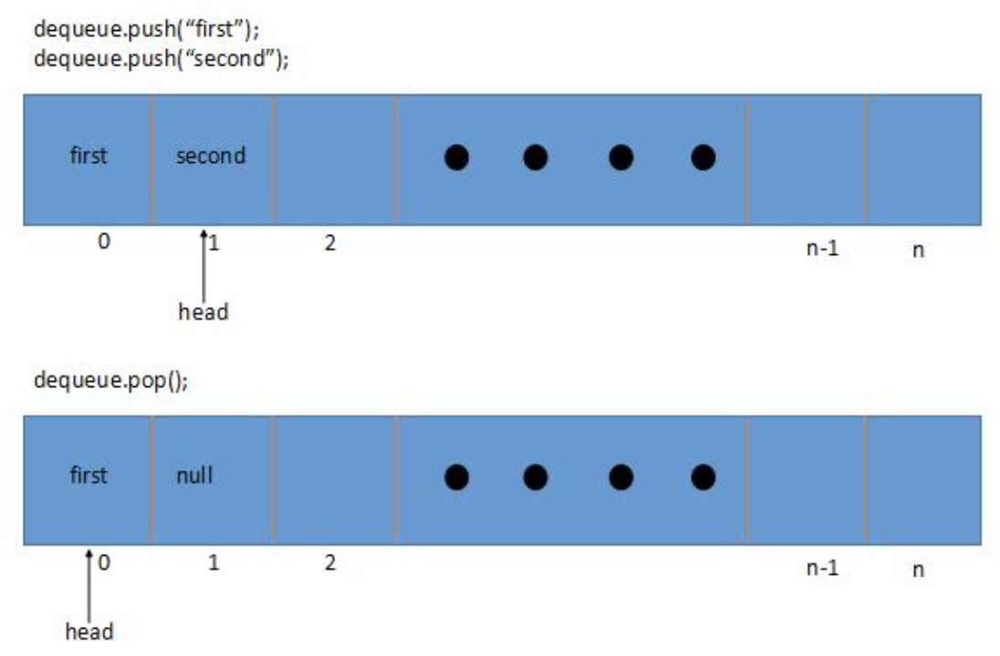


Add an element using `push(e)` and remove the last element using `pop()`

Internally:

- `push(e)` calls `addFirst(e)`
- `pop()` calls `removeFirst()`

```java
    public static void arraydeque_as_stack() {
        Deque<String> stack = new ArrayDeque<>();
        stack.push("first");
        stack.push("second");
        stack.push("third");

        System.out.println("Initial Stack: " + stack);
        stack.pop();
        System.out.println("Stack after pop(): " + stack);
    }

    // equivalent in using addFirst and removeFirst
    public static void arraydeque_addFirst_removeFirst() {
        Deque<String> queue = new ArrayDeque<>();
        queue.addFirst("first");
        queue.addFirst("second");
        queue.addFirst("third");

        System.out.println("Initial queue addFirst(): " + queue);
        queue.removeFirst();
        System.out.println("queue after removeFirst(): " + queue);
    }
```

Output:

```
Initial Stack: [third, second, first]
Stack after pop(): [second, first]
```


---

#### Use `ArrayDeque` as `Queue`

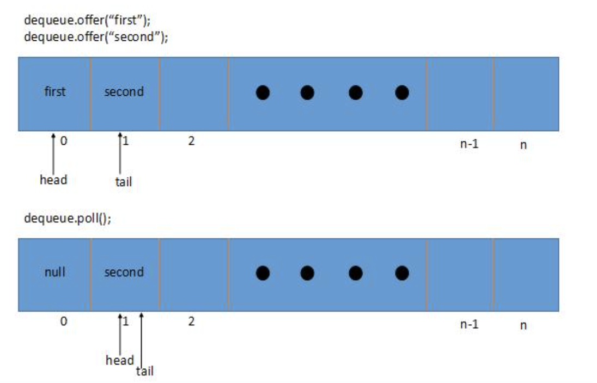


Add an element using `offer(e)` and remove the first element using `poll()`

Internally:

- `offer(e)` calls `offerLast(e)`
- `poll()` calls `pollFirst()`

```java
    public static void arraydeque_as_queue() {
        Deque<String> queue = new ArrayDeque<>();
        queue.offer("first");
        queue.offer("second");
        queue.offer("third");

        System.out.println("Initial queue: " + queue);
        queue.poll();
        System.out.println("queue after pop(): " + queue);
    }

		// equivalent in using addLast and removeFirst
    public static void arraydeque_addLast_removeFirst() {
        Deque<String> queue = new ArrayDeque<>();
        queue.addLast("first");
        queue.addLast("second");
        queue.addLast("third");

        System.out.println("Initial queue addLast(): " + queue);
        queue.removeFirst();
        System.out.println("queue after removeFirst(): " + queue);
    }
```

Ouput:

```
Initial queue: [first, second, third]
queue after pop(): [second, third]
```


---

#### Capacity Expansion

Everytime an element is added into the`ArrayDeque`, it compares the `head` pointer and the `tail` pointer. If they are equal, it indicates that the array is full.

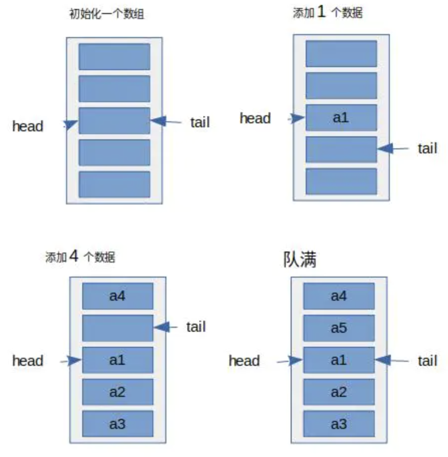

Then `doubleCapacity()` will be called:

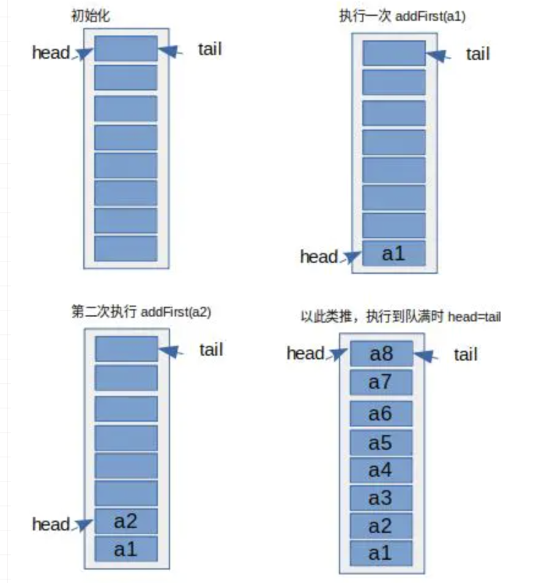

