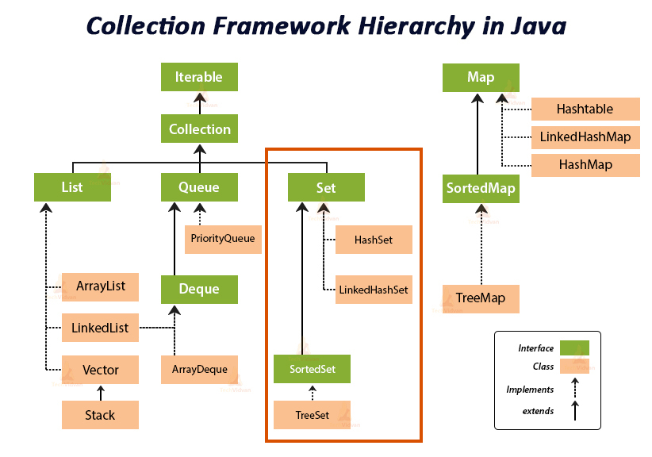

## Set Interface Overview

A [`Set`](https://docs.oracle.com/javase/8/docs/api/java/util/Set.html) is a [`Collection`](https://docs.oracle.com/javase/8/docs/api/java/util/Collection.html) that cannot contain duplicate elements. It contains only methods inherit from `Collection` and adds the restriction that duplicate elements are prohibited. `Set` adds a strong contract on the behavior of the `equals` and `hashCode` operations. Two sets are equal if if they contain the same elements.

